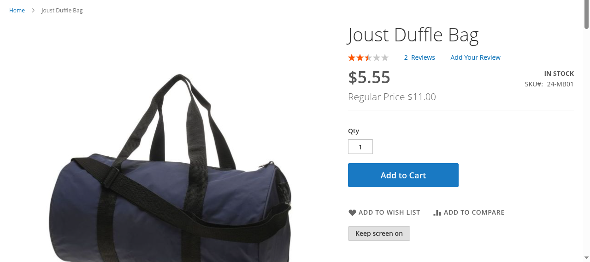

# BroCode_ScreenAwake

A **"Keep screen on"** button for Magento 2 product and CMS pages. It keeps the customer's
phone screen awake while they follow the page: assembly steps, care routines, fitting
guides, a recipe on a kitchenware product. It uses the browser's
[Screen Wake Lock API](https://developer.mozilla.org/en-US/docs/Web/API/Screen_Wake_Lock_API).
The customer taps the button once and the screen stays on until they tap it again or
leave the page.

**Module page:** [brocode.at/modules/module-screen-awake/](https://brocode.at/modules/module-screen-awake/)

```bash
composer require brocode/module-screen-awake
bin/magento module:enable BroCode_ScreenAwake
bin/magento setup:upgrade
bin/magento cache:flush
```

In production mode, also run `setup:di:compile` and `setup:static-content:deploy` as
usual.



## What it does

- **One button, no new content.** The page stays exactly as it is. The button is the
  only thing the module adds.
- **Only where it makes sense.** On product pages the button renders only for products
  whose attribute **Show 'Keep Screen On' Button** (group *Content*, store-view scope)
  is set to *Yes*. A product without instructions doesn't get a button.
- **CMS pages via widget.** Insert the widget **Keep Screen On Button** into any CMS
  page or block, such as a guide page.
- **One switch per store view.** *Stores > Configuration > Catalog > Catalog > Keep
  Screen On Button > Enabled* turns the button off everywhere, product pages and widgets
  alike. Default: on.
- **Survives tab switches.** The browser drops the lock whenever the page is hidden,
  for example when the customer switches to the timer app. The button requests it again
  when the page becomes visible. Without that, the screen goes dark two minutes after
  the first switch.
- **Invisible where unsupported.** The button starts `hidden` and only appears when
  `navigator.wakeLock` exists: Chrome and Edge 84+, Safari 16.4+ (iOS included), and
  Firefox 126+.
- **CSP-safe.** No inline script; the component loads through `data-mage-init`.

## Hooks for the theme and analytics

The module ships no styling beyond Luma's `action secondary` button classes. Two hooks
let a theme or tag manager do more:

| Hook | Use |
|---|---|
| `body.is-screen-awake` | Present while the customer wants the screen on. Style larger type or hide sticky banners in your own theme CSS. |
| `screenawake:change` event on `document` | `event.detail.on` is `true` / `false`. Push it to the dataLayer to measure usage. |

```javascript
document.addEventListener('screenawake:change', (e) => {
  window.dataLayer = window.dataLayer || [];
  window.dataLayer.push({ event: 'screen_awake', screen_awake_on: e.detail.on });
});
```

## Requirements and limits

- Magento 2.4.x, PHP 8.1–8.4. Verified on 2.4.8-p5 with Luma.
- [`brocode/module-entityservices`](https://github.com/brosenberger/module-entityservices)
  creates the product attribute; Composer installs it automatically.
- **Luma-based themes.** Hyvä doesn't load RequireJS components, so a Hyvä store needs
  a small compatibility template (an Alpine `x-data` wrapper around the same logic).
  That template isn't included.
- The site must be served over HTTPS; the API only exists in secure contexts.
- A `Permissions-Policy` header containing `screen-wake-lock=()` blocks the lock
  entirely. Check your server headers if the button toggles but the screen still dims.
- Headless browsers refuse the lock (`NotAllowedError`). Test in a real browser.

## Uninstall

```bash
bin/magento module:uninstall BroCode_ScreenAwake
```

`module:uninstall` reverts the data patch and removes the `screen_awake_button`
attribute. When removing the package by hand instead, delete the attribute yourself.

## License

MIT, see [LICENSE](LICENSE).

If this saves you time: [buy me a coffee](https://www.buymeacoffee.com/brosenberger).
